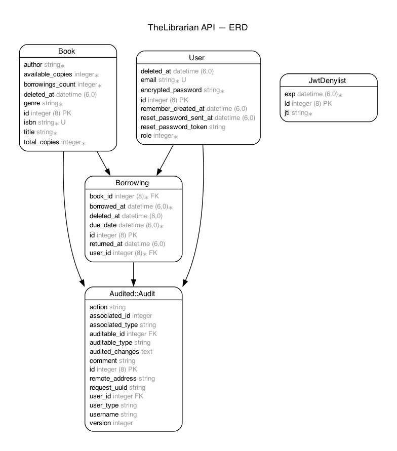

# 📚 Library Management API

A **production-ready Ruby on Rails RESTful API** for library management, featuring JWT authentication, role-based authorization, book management, borrowing workflows, and analytics dashboards — all built following **test-driven development (TDD)** principles.

[]()
[]()
[]()
[]()
[](https://thelibrarian-api.onrender.com)

---

## 🎯 Overview

This API supports two user roles:

- **Librarians** - Manage books, track borrowings, monitor library activity
- **Members** - Browse books, borrow/return items, track due dates

Built with clean architecture, comprehensive test coverage, and production-ready deployment configuration.

---

## 📚 Documentation

- 📘 [User Stories](./docs/USER_STORIES.md) - Functional requirements and API endpoints
- 📖 [API Documentation](./docs/API_DOCUMENTATION.md) - Complete endpoint reference with examples
- 🧱 [Development Roadmap](./docs/ROADMAP.md) - TDD development guide and implementation steps

---

## ⚙️ Tech Stack

| Category           | Technology                             |
| ------------------ | -------------------------------------- |
| **Language**       | Ruby 3.4.7                             |
| **Framework**      | Ruby on Rails 8.0.4 (API mode)         |
| **Database**       | PostgreSQL 14.17                       |
| **Authentication** | Devise + Devise-JWT                    |
| **Authorization**  | Pundit                                 |
| **Testing**        | RSpec + FactoryBot + Faker + SimpleCov |
| **Pagination**     | Pagy                                   |
| **Soft Delete**    | Paranoia                               |
| **Audit Logging**  | Audited                                |
| **API Docs**       | Rswag (Swagger/OpenAPI)                |
| **CI/CD**          | GitHub Actions                         |
| **Deployment**     | Docker + Render.com                    |
| **Code Quality**   | RuboCop + Brakeman                     |

---

## 🎯 Features

| Feature                      | Description                                               |
| ---------------------------- | --------------------------------------------------------- |
| 👤 **Authentication**        | JWT-based auth with Devise (sign up, sign in, sign out)   |
| 🔐 **Authorization**         | Role-based access control with Pundit (Librarian/Member)  |
| 📚 **Book Management**       | Full CRUD for librarians, read-only for members           |
| 🔍 **Search & Filter**       | Search by title/author/ISBN, filter by genre/availability |
| 📖 **Borrowing System**      | Borrow/return books with automatic due dates (14 days)    |
| 📊 **Dashboards**            | Role-specific analytics and borrowing insights            |
| 📄 **Pagination**            | Pagy-powered pagination on all list endpoints             |
| 🗑️ **Soft Delete**           | Paranoia gem for logical deletion with restore capability |
| 📝 **Audit Logging**         | Complete audit trail of all changes with Audited gem      |
| 📚 **API Documentation**     | Interactive Swagger/OpenAPI docs at `/api-docs`           |
| 🐳 **Docker Support**        | Full Docker Compose setup for local development           |
| 🚀 **CI/CD**                 | GitHub Actions with automated testing and deployment      |
| 🌐 **Production Deployment** | Live on Render.com with PostgreSQL database               |

---

## 🌐 Try It Out (Live API)

The API is deployed and ready to use:

- **Swagger UI:** [https://thelibrarian-api.onrender.com/api-docs](https://thelibrarian-api.onrender.com/api-docs)
- **OpenAPI:** [https://thelibrarian-api.onrender.com/api-docs/v1/swagger.yaml](https://thelibrarian-api.onrender.com/api-docs/v1/swagger.yaml)

---

## 🚀 Quick Start (Local Development)

### Option 1: Local Setup

```bash
# 1. Clone the repository
git clone https://github.com/jlgasparrini/thelibrarian-api.git
cd thelibrarian-api

# 2. Install dependencies
bundle install

# 3. Create .env file
cp .env.example .env

# 4. Setup database
rails db:create db:migrate db:seed

# 5. Run tests
bundle exec rspec

# 6. Start server
rails server
```

### Option 2: Docker Setup

```bash
# 1. Clone and setup
git clone https://github.com/jlgasparrini/thelibrarian-api.git
cd thelibrarian-api
cp .env.example .env

# 2. Build and run
docker compose up

# 3. Setup database (in another terminal)
docker compose exec web rails db:prepare db:seed

# 4. Run tests
docker compose exec web bundle exec rspec
```

### 🔑 Demo Credentials

After running `db:seed`:

- **Librarian:** `admin@library.com` / `password`
- **Member:** `member@library.com` / `password`
- **Member:** `john.doe@library.com` / `password`
- **Member:** `jane.smith@library.com` / `password`

### 🧪 Verify Installation

```bash
# Health check
curl http://localhost:3000/api/v1/health

# Should return: {"status":"ok"}
```

---

## 🧪 Testing

### Test Coverage

- Model specs (validations, associations, scopes, audit logging)
- Request specs (endpoints, authentication, authorization)
- Policy specs (role-based access control)
- Integration specs (API documentation with Rswag)

### Run Tests

```bash
# All tests (with coverage report)
bundle exec rspec

# Specific file
bundle exec rspec spec/models/book_spec.rb

# With documentation format
bundle exec rspec --format documentation

# View coverage report
open coverage/index.html
```

## 🏗️ Architecture & Design Patterns

### System Architecture Diagram (ERD)



Generate/update the diagram locally (requires Graphviz):

```bash
brew install graphviz   # or: sudo apt-get install -y graphviz
bundle install
bundle exec erd         # outputs to docs/erd.png
```

### Clean Architecture

- **Controllers** - Handle HTTP concerns only
- **Services** - Complex business logic (e.g., DashboardService)
- **Serializers** - JSON response formatting
- **Policies** - Authorization rules
- **Concerns** - Reusable modules (JsonResponse, JwtAuthentication)

### Key Patterns

- **Service Objects** - Encapsulate complex operations
- **Serializers** - Consistent API responses
- **Scopes** - Reusable query logic
- **Constants** - Centralized configuration
- **Policy Objects** - Authorization logic separation

---

## 👤 Author

**Leonel Gasparrini**
Ruby on Rails Developer
🇦🇷 Argentina

- [GitHub](https://github.com/jlgasparrini)
- [LinkedIn](https://linkedin.com/in/jlgasparrini/)

---
